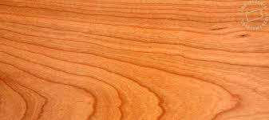
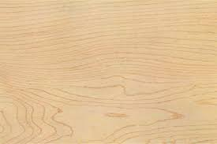
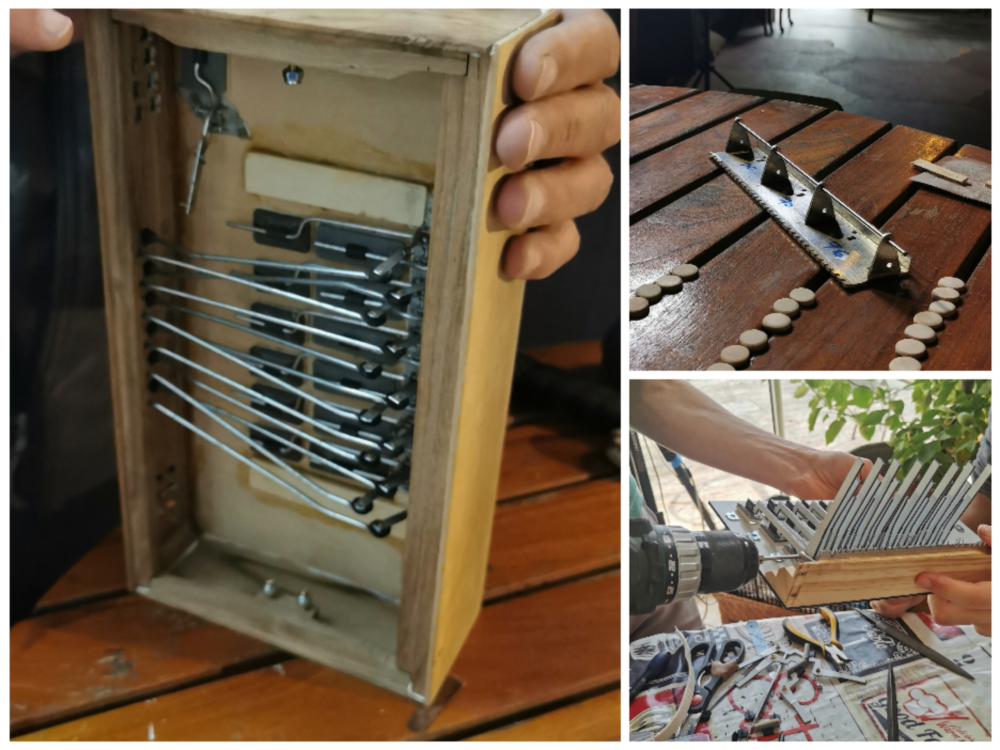
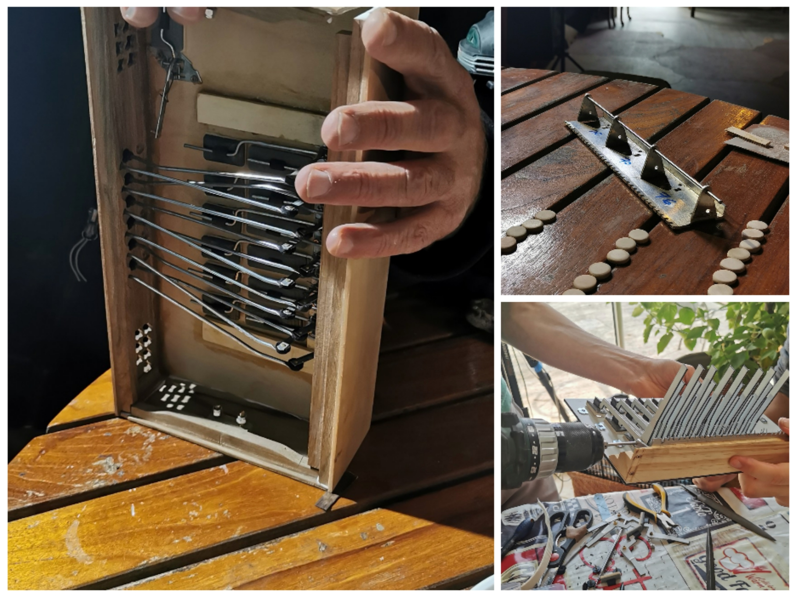
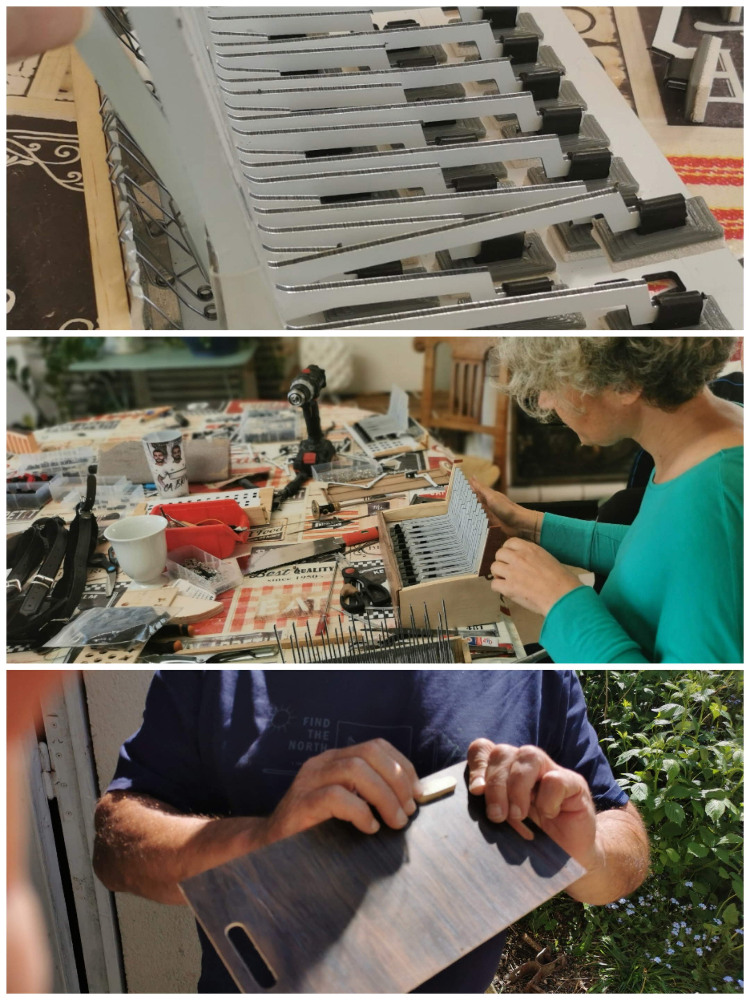

# Galerie des Stages de Lutherie / Workshop Gallery

Cette galerie présente les différentes étapes de fabrication d'un accordéon diatonique lors de nos stages de 10 jours.

This gallery showcases the different stages of building a diatonic accordion during our 10-day workshops.

---

## Matériaux / Materials

### Bois de Cerisier / Cherry Wood

### Bois de Noyer / Walnut Wood

### Bois d'Érable / Maple Wood

---

## Visuels de Communication / Communication Visuals

---

## Collages de Présentation / Presentation Collages

---

## Jour 1 / Day 1

.jpg)

.jpg)

.jpg)

.jpg)

.jpg)

.jpg)

.jpg)

---

## Jour 2 / Day 2

.jpg)

.jpg)

.jpg)

.jpg)

.jpg)

.jpg)

.jpg)

.jpg)

.jpg)

---

## Jour 3 / Day 3

---

## Jour 4 / Day 4

.jpg)

.jpg)

.jpg)

.jpg)

.jpg)

---

## Jour 5 / Day 5

.jpg)

.jpg)

.jpg)

.jpg)

.jpg)

.jpg)

.jpg)

.jpg)

---

## Jour 6 / Day 6

---

## Jour 7 / Day 7

.jpg)

.jpg)

.jpg)

.jpg)

---

## Jour 8 / Day 8

.jpg)

.jpg)

.jpg)

---

## Jour 9 / Day 9

.jpg)

.jpg)

.jpg)

.jpg)

---

## Jour 10 / Day 10

.jpg)

%20-%20Copie.jpg)

.jpg)

.jpg)

.jpg)

---

## Images Additionnelles / Additional Images

> **Note:** Les images suivantes sont au format HEIC (Apple). Elles peuvent ne pas s'afficher dans tous les navigateurs web. Pour une meilleure compatibilité, envisagez de les convertir au format JPEG ou PNG.
> 
> **Note:** The following images are in HEIC format (Apple). They may not display in all web browsers. For better compatibility, consider converting them to JPEG or PNG format.

---

## À propos / About

Ce stage de lutherie vous permet de fabriquer votre propre accordéon diatonique en 10 jours, guidé par des luthiers professionnels. Pour plus d'informations, consultez les autres fichiers de ce dépôt.

This lutherie workshop allows you to build your own diatonic accordion in 10 days, guided by professional luthiers. For more information, check the other files in this repository.

**Contact:** contact@ewendaviau.com  
**Site web:** https://stages.ewendaviau.com
